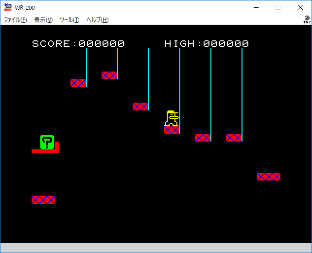

# Programs for JR-200

This repository stores programs for JR-200,
an 8-bit personal computer that was provided by Panasonic back in 1982.

## JR-200 Emulator

VJR-200, a JR-200 emulator that runs on Windows, is available
[here](http://www.geocities.jp/find_jr200/index.html).

The emulator requires ROM images of JR-200. Searching sites with terms "JR-200 ROM"
may give you information on how to retrieve these images.

After launching VJR-200, push `[Ctrl]`+`[Alt]`+`[L]` or select menu `[ファイル(F)]`-`[CJR高速ロード(L)]` to
load a CJR file and then type in `RUN` followed by `[Enter]` key in the JR BASIC prompt to execute it.

Have fun!

## HORE HOLE

This game has been released in Micom BASIC Magazine in July 1989.

[HOREHOLE.cjr](../../raw/master/HOREHOLE.cjr)

The rules:

- The circle-shaped character is named Bean.

- Move the Bean by cursor keys and dig up underground waters represented by light-blued squares.

- You have to fight with a dwarf disturbing you from side by dropping it in a hole,
  which is filled by the dward falling in it.

- The Bean would fall in a hole the size of more than two characters.

- Each stage is completed when you dig up all the underground waters.
  The underground waters are placed at deeper level as the stage advances.

## ELEVATOR

This game has been released in Micom BASIC Magazine in Feburary 1984.

[ELEVATOR.cjf](../../raw/master/ELEVATOR.cjr)

The rules:

- You're a transporter who carries loads by moving from left to right.

- Push `[SPACE]` key to jump onto the next elevator until you reach at the goal on the left side.

- The stage is cleared when you get to the goal six times.

- The speed of elevators gets slower as the stage advances.

- Loads are stacked up as time passes.

- The game is over when one of the following events happens:

  - Fails to land on an elevator.
  - Crashes onto the top of the screen.
  - There are five loads stacked up.
